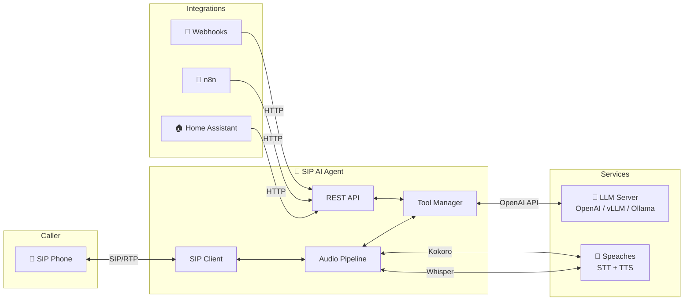

> 🤖 **ROBO CODED** — This documentation was made with AI and may not be 100% sane. But the code does work! 🎉



**Component Overview:**

| Component | Description |
|-----------|-------------|
| 📱 **SIP Phone** | Any SIP-compatible phone or softphone |
| 🤖 **SIP AI Agent** | Core application handling calls and conversations |
| 🧠 **LLM Server** | Language model for understanding and responses |
| 🎤 **Speaches** | Unified STT (Whisper) and TTS (Kokoro) server |
| 🔗 **Integrations** | External systems that trigger calls via API |


---

## 💡 Use Cases

| Use Case | Example |
|----------|---------|
| ⏲️ **Timers & Reminders** | *"Set a timer for 10 minutes"* |
| 📞 **Callbacks** | *"Call me back in an hour"* |
| 🌤️ **Weather Briefings** | Scheduled morning weather calls |
| 📅 **Appointment Reminders** | Outbound calls with confirmation |
| 🚨 **Alerts & Notifications** | Webhook-triggered phone calls |
| 🏠 **Smart Home** | Voice control via phone |

---

## 🧠 Recommended Models

Quick reference for GPU-specific configurations. See [Configuration](configuration) for full details.

| GPU | VRAM | Recommended LLM | STT Model |
|-----|------|-----------------|-----------|
| H100 / A100 | 80GB | `meta-llama/Llama-3.1-70B-Instruct` | `faster-whisper-large-v3` |
| DGX Spark | 128GB | `meta-llama/Llama-3.1-70B-Instruct` | `faster-whisper-large-v3` |
| RTX 5090 | 32GB | `Qwen/Qwen2.5-32B-Instruct` | `faster-whisper-large-v3` |
| RTX 4090 | 24GB | `Qwen/Qwen2.5-14B-Instruct` | `faster-whisper-large-v3` |
| RTX 3090 | 24GB | `meta-llama/Llama-3.1-8B-Instruct` | `faster-whisper-medium` |
| RTX 4080 | 16GB | `meta-llama/Llama-3.1-8B-Instruct` | `faster-whisper-medium` |
| RTX 3080 | 10GB | `Qwen/Qwen2.5-7B-Instruct` | `faster-whisper-small` |

---

## 📚 Documentation

1. [🚀 Getting Started](doc:getting-started) — Installation & setup
1. [🏗️ Architecture](doc:architecture) — Installation & setup
2. [⚙️ Configuration](doc:configuration) — Environment variables
3. [🌐 API Reference](doc:api-reference) — REST API endpoints
4. [🔧 Built-in Tools](doc:tools) — Available capabilities
5. [🔌 Creating Plugins](doc:plugins) — Add custom tools
6. [📖 Examples](doc:examples) — Integration patterns

---

## 📦 Quick Install

```bash
# Clone the repository
git clone https://github.com/your-org/sip-agent.git
cd sip-agent

# Configure environment
cp .env.example .env
nano .env

# Start with Docker Compose
docker compose up -d

# Verify it's running
curl http://localhost:8080/health
```

**Expected output:**

```json
{
  "status": "healthy",
  "sip_registered": true,
  "active_calls": 0
}
```

---

## 🆘 Support

- 📖 [Documentation](https://docs.example.com)
- 🐛 [Issue Tracker](https://github.com/your-org/sip-agent/issues)
- 💬 [Discussions](https://github.com/your-org/sip-agent/discussions)
