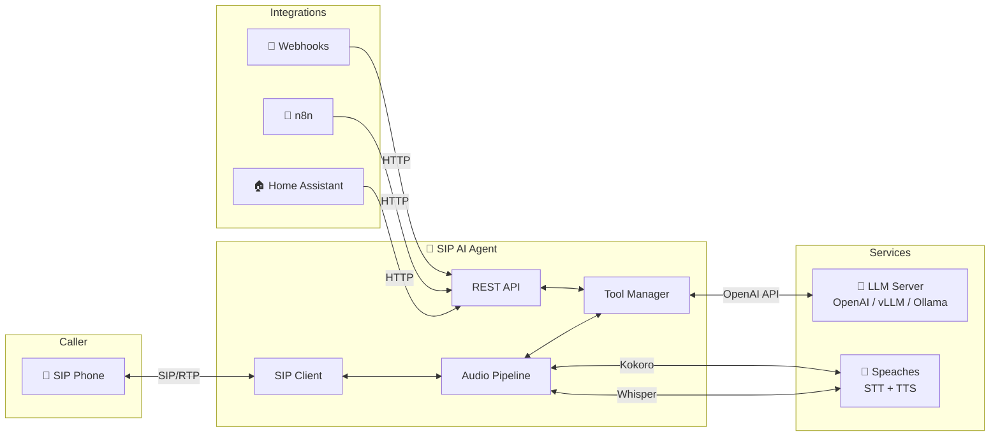
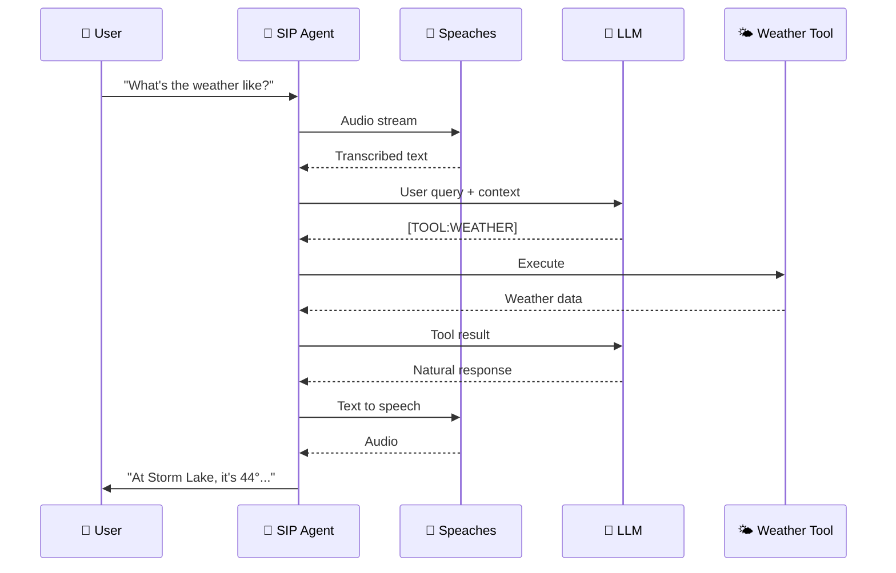

> 🤖 **ROBO CODED** — This documentation was made with AI and may not be 100% sane. But the code does work! 🎉

# 📞 SIP AI Assistant

A voice-powered AI assistant that answers phone calls, understands natural language, and can perform actions like setting timers, checking weather, scheduling callbacks, and more.


<!-- TODO: Architecture diagram showing SIP phone -> Agent -> LLM/STT/TTS flow -->

---

## ✨ Features

| Feature | Description |
|---------|-------------|
| 🎙️ **Voice Conversations** | Natural speech-to-text and text-to-speech powered by Whisper and Kokoro |
| 🤖 **LLM Integration** | Connects to OpenAI, vLLM, Ollama, LM Studio, and more |
| 🔧 **Built-in Tools** | Weather, timers, callbacks, date/time, calculator |
| 🔌 **Plugin System** | Easily add custom tools with Python |
| 🌐 **REST API** | Initiate outbound calls, execute tools, schedule calls |
| 🔗 **Webhooks** | Trigger calls from Home Assistant, n8n, and more |
| ⏰ **Scheduled Calls** | One-time or recurring calls (daily briefings, reminders) |
| 🗣️ **Custom Phrases** | Customize greetings, goodbyes, and responses via config |
| 📊 **Observability** | Prometheus metrics, OpenTelemetry tracing, JSON logs |

---

## 🏗️ Architecture



**Component Overview:**

| Component | Description |
|-----------|-------------|
| 📱 **SIP Phone** | Any SIP-compatible phone or softphone |
| 🤖 **SIP AI Agent** | Core application handling calls and conversations |
| 🧠 **LLM Server** | Language model for understanding and responses |
| 🎤 **Speaches** | Unified STT (Whisper) and TTS (Kokoro) server |
| 🔗 **Integrations** | External systems that trigger calls via API |

---

## 🚀 Quick Example

Call the assistant and say:

> 🗣️ *"What's the weather like?"*



**Assistant responds:**

> 🤖 *"At Storm Lake, as of 9:30 pm, it's 44 degrees with foggy conditions. Wind is calm."*


<!-- TODO: Screenshot of log viewer showing a weather query conversation -->

---

## 💡 Use Cases

| Use Case | Example |
|----------|---------|
| ⏲️ **Timers & Reminders** | *"Set a timer for 10 minutes"* |
| 📞 **Callbacks** | *"Call me back in an hour"* |
| 🌤️ **Weather Briefings** | Scheduled morning weather calls |
| 📅 **Appointment Reminders** | Outbound calls with confirmation |
| 🚨 **Alerts & Notifications** | Webhook-triggered phone calls |
| 🏠 **Smart Home** | Voice control via phone |

---

## 🧠 Recommended Models

Quick reference for GPU-specific configurations. See [Configuration](configuration) for full details.

| GPU | VRAM | Recommended LLM | STT Model |
|-----|------|-----------------|-----------|
| H100 / A100 | 80GB | `meta-llama/Llama-3.1-70B-Instruct` | `faster-whisper-large-v3` |
| DGX Spark | 128GB | `meta-llama/Llama-3.1-70B-Instruct` | `faster-whisper-large-v3` |
| RTX 5090 | 32GB | `Qwen/Qwen2.5-32B-Instruct` | `faster-whisper-large-v3` |
| RTX 4090 | 24GB | `Qwen/Qwen2.5-14B-Instruct` | `faster-whisper-large-v3` |
| RTX 3090 | 24GB | `meta-llama/Llama-3.1-8B-Instruct` | `faster-whisper-medium` |
| RTX 4080 | 16GB | `meta-llama/Llama-3.1-8B-Instruct` | `faster-whisper-medium` |
| RTX 3080 | 10GB | `Qwen/Qwen2.5-7B-Instruct` | `faster-whisper-small` |

---

## 🎬 Demo


<!-- TODO: Video thumbnail or animated GIF showing a call in progress -->

```
# Example call flow
┌──────────────────────────────────────────────────────────────┐
│  📞 Incoming call from: +1 (555) 123-4567                    │
├──────────────────────────────────────────────────────────────┤
│  🤖 "Hello! This is your AI assistant. How can I help?"     │
│  👤 "What time is it?"                                       │
│  🤖 "It's 3:45 PM on Saturday, November 30th."              │
│  👤 "Set a timer for 5 minutes"                              │
│  🤖 "Timer set for 5 minutes. I'll let you know!"           │
│  👤 "Thanks, goodbye"                                        │
│  🤖 "Goodbye! Have a great day!"                            │
│  📴 Call ended (duration: 0:32)                              │
└──────────────────────────────────────────────────────────────┘
```

---

## 📚 Documentation

1. [🚀 Getting Started](getting-started) — Installation & setup
2. [⚙️ Configuration](configuration) — Environment variables
3. [🌐 API Reference](api-reference) — REST API endpoints
4. [🔧 Built-in Tools](tools) — Available capabilities
5. [🔌 Creating Plugins](plugins) — Add custom tools
6. [📖 Examples](examples) — Integration patterns

---

## 📦 Quick Install

```bash
# Clone the repository
git clone https://github.com/your-org/sip-agent.git
cd sip-agent

# Configure environment
cp .env.example .env
nano .env

# Start with Docker Compose
docker compose up -d

# Verify it's running
curl http://localhost:8080/health
```

**Expected output:**

```json
{
  "status": "healthy",
  "sip_registered": true,
  "active_calls": 0
}
```

---

## 🆘 Support

- 📖 [Documentation](https://docs.example.com)
- 🐛 [Issue Tracker](https://github.com/your-org/sip-agent/issues)
- 💬 [Discussions](https://github.com/your-org/sip-agent/discussions)
