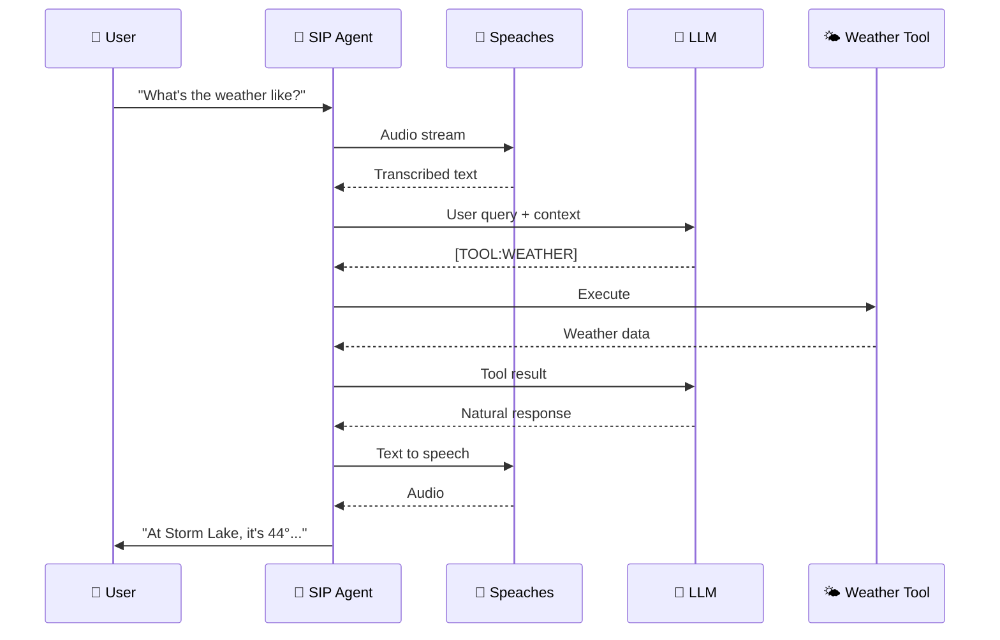

<Callout icon="🤖" theme="default">
  ### **ROBO CODED** — This documentation was made with AI and may not be 100% sane. But the code does work! 🎉
</Callout>

# 📞 SIP AI Assistant

A voice-powered AI assistant that answers phone calls, understands natural language, and can perform actions like setting timers, checking weather, scheduling callbacks, and more.

<Image align="center" border={false} src="https://files.readme.io/a92deb386faea1adff77245d6548c6167986423c563d1ae0db4a83a72c9db563-Screenshot_2025-11-29_214430.png" />

***

## ✨ Features

| Feature                     | Description                                                             |
| --------------------------- | ----------------------------------------------------------------------- |
| 🎙️ **Voice Conversations** | Natural speech-to-text and text-to-speech powered by Whisper and Kokoro |
| 🤖 **LLM Integration**      | Connects to OpenAI, vLLM, Ollama, LM Studio, and more                   |
| 🔧 **Built-in Tools**       | Weather, timers, callbacks, date/time, calculator                       |
| 🔌 **Plugin System**        | Easily add custom tools with Python                                     |
| 🌐 **REST API**             | Initiate outbound calls, execute tools, schedule calls                  |
| 🔗 **Webhooks**             | Trigger calls from Home Assistant, n8n, and more                        |
| ⏰ **Scheduled Calls**       | One-time or recurring calls (daily briefings, reminders)                |
| 🗣️ **Custom Phrases**      | Customize greetings, goodbyes, and responses via config                 |
| 📊 **Observability**        | Prometheus metrics, OpenTelemetry tracing, JSON logs                    |

***

## 🚀 Quick Example

Call the assistant and say:

<Callout icon="🗣️" theme="default">
  ### _"What's the weather like?"_
</Callout>



**Assistant responds:**

<Callout icon="🤖" theme="default">
  ### _"At Storm Lake, as of 9:30 pm, it's 44 degrees with foggy conditions. Wind is calm."_
</Callout>

<Image align="center" alt="Example conversation flow" border={false} src="https://files.readme.io/08cfc62ea5875c2848a9bdbe07c0ffb72b1236a94ea946fb03e34d6ab6aaf8e5-Screenshot_2025-11-29_214959.png" />

***

## 💡 Use Cases

| Use Case                      | Example                          |
| ----------------------------- | -------------------------------- |
| ⏲️ **Timers & Reminders**     | _"Set a timer for 10 minutes"_   |
| 📞 **Callbacks**              | _"Call me back in an hour"_      |
| 🌤️ **Weather Briefings**     | Scheduled morning weather calls  |
| 📅 **Appointment Reminders**  | Outbound calls with confirmation |
| 🚨 **Alerts & Notifications** | Webhook-triggered phone calls    |
| 🏠 **Smart Home**             | Voice control via phone          |

***

## 🧠 Recommended Models

Quick reference for GPU-specific configurations. See [Configuration](configuration) for full details.

| GPU         | VRAM  | Recommended LLM                     | STT Model                 |
| ----------- | ----- | ----------------------------------- | ------------------------- |
| H100 / A100 | 80GB  | `meta-llama/Llama-3.1-70B-Instruct` | `faster-whisper-large-v3` |
| DGX Spark   | 128GB | `meta-llama/Llama-3.1-70B-Instruct` | `faster-whisper-large-v3` |
| RTX 5090    | 32GB  | `Qwen/Qwen2.5-32B-Instruct`         | `faster-whisper-large-v3` |
| RTX 4090    | 24GB  | `Qwen/Qwen2.5-14B-Instruct`         | `faster-whisper-large-v3` |
| RTX 3090    | 24GB  | `meta-llama/Llama-3.1-8B-Instruct`  | `faster-whisper-medium`   |
| RTX 4080    | 16GB  | `meta-llama/Llama-3.1-8B-Instruct`  | `faster-whisper-medium`   |
| RTX 3080    | 10GB  | `Qwen/Qwen2.5-7B-Instruct`          | `faster-whisper-small`    |

***

## 🎬 Demo

<Image alt="Demo video thumbnail" border={false} src="screenshots/demo-video.png" />

```
# Example call flow
┌──────────────────────────────────────────────────────────────┐
│  📞 Incoming call from: +1 (555) 123-4567                    │
├──────────────────────────────────────────────────────────────┤
│  🤖 "Hello! This is your AI assistant. How can I help?"     │
│  👤 "What time is it?"                                       │
│  🤖 "It's 3:45 PM on Saturday, November 30th."              │
│  👤 "Set a timer for 5 minutes"                              │
│  🤖 "Timer set for 5 minutes. I'll let you know!"           │
│  👤 "Thanks, goodbye"                                        │
│  🤖 "Goodbye! Have a great day!"                            │
│  📴 Call ended (duration: 0:32)                              │
└──────────────────────────────────────────────────────────────┘
```

***

## 📚 Documentation

1. [🚀 Getting Started](doc:getting-started) — Installation & setup
2. [⚙️ Configuration](doc:configuration) — Environment variables
3. [🌐 API Reference](doc:api-reference) — REST API endpoints
4. [🔧 Built-in Tools](doc:tools) — Available capabilities
5. [🔌 Creating Plugins](doc:plugins) — Add custom tools
6. [📖 Examples](doc:examples) — Integration patterns

***

## 📦 Quick Install

```bash
# Clone the repository
git clone https://github.com/your-org/sip-agent.git
cd sip-agent

# Configure environment
cp .env.example .env
nano .env

# Start with Docker Compose
docker compose up -d

# Verify it's running
curl http://localhost:8080/health
```

**Expected output:**

```json
{
  "status": "healthy",
  "sip_registered": true,
  "active_calls": 0
}
```

***

## 🆘 Support

* 📖 [Documentation](https://docs.example.com)
* 🐛 [Issue Tracker](https://github.com/your-org/sip-agent/issues)
* 💬 [Discussions](https://github.com/your-org/sip-agent/discussions)
